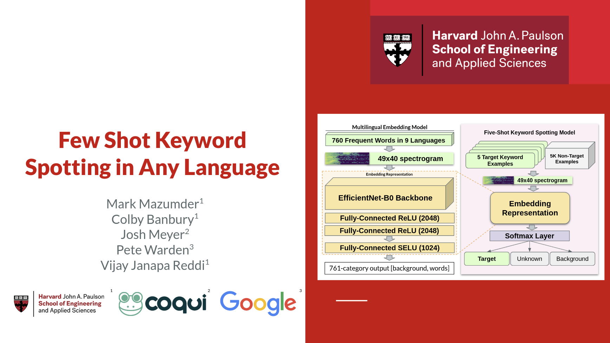
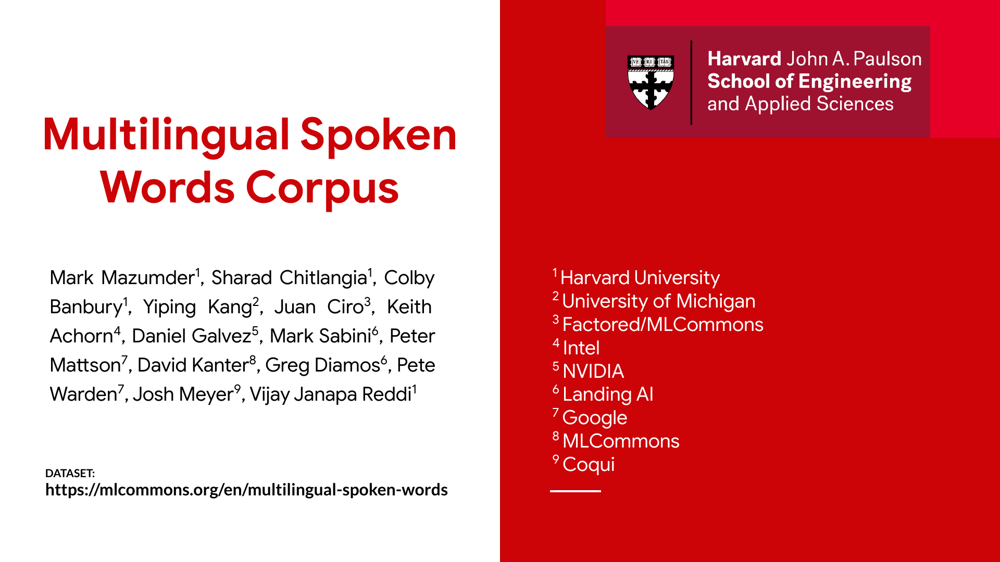

This is the repository for the following papers:
* [Few-Shot Keyword Spotting in Any Language](https://www.isca-speech.org/archive/pdfs/interspeech_2021/mazumder21_interspeech.pdf), Interspeech 2021
* [Multilingual Spoken Words Corpus](https://openreview.net/pdf?id=c20jiJ5K2H), NeurIPS 2021 Datasets and Benchmarks Track

# Introductory Colab Tutorial

Launch [our introductory tutorial on Google Colab](https://colab.research.google.com/github/harvard-edge/multilingual_kws/blob/main/multilingual_kws_intro_tutorial.ipynb) to explore our dataset and train a few-shot keyword-spotting model:

# Download the Multilingual Spoken Words Corpus

Our full dataset is available at https://mlcommons.org/words

# Videos

[[`Few-Shot Keyword Spotting in Any Language: youtube video overview`](https://www.youtube.com/watch?v=1JRlJoEhYxE)]

[[`Multilingual Spoken Words Corpus: youtube video overview`](https://www.youtube.com/watch?v=1JRlJoEhYxE)]

---
Additional documentation coming soon!